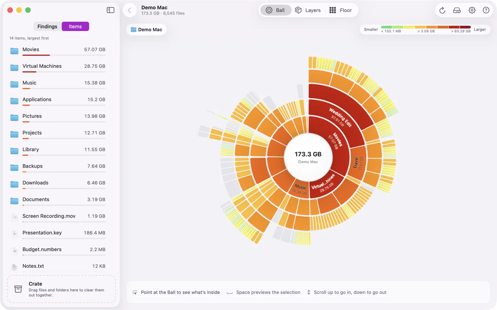

# Discotech

[](LICENSE)
[](https://github.com/thepixelabs/discotech/releases/latest)

Discotech is a free, open-source disk space map for macOS. It scans a drive or folder, shows every file by size in three views, points out space that is usually safe to clear, and moves what you pick to the Trash with checks at every step. Scan results stay in memory.



Website: <https://discotech.pixelabs.net>

## Features

- **Three views of one scan.** Ball (`⌘1`): the folder in view at the centre, each ring one level deeper. Layers (`⌘2`): one column per level, items stacked by size. Floor (`⌘3`): blocks sized by the space they take.
- **Colour that means something.** Pick a palette style, Gradient or Multicolour, then a theme. Colour by size, kind of content or top-level folder. Changes redraw at once, with no rescan (Settings, `⌘,`).
- **Findings.** Cleanup suggestions in two groups. *Safe to clear* covers output that rebuilds itself, such as `node_modules`, build folders and package, browser and app caches. *Review first* covers things that are probably unneeded but personal, such as Xcode archives, device backups, local AI models, VM images, installers in Downloads and your largest files. Each suggestion says why it can be cleared, opens as a Finder-style list, and you can select several rows (Shift-click, ⌘-click, ⌘A) to add to or take out of the Crate together.
- **The Crate.** Drag items into the Crate as you explore, then review them in one window (`⌘⌫`). Nothing moves until you confirm. Items in system or app-data folders are flagged, and you are asked again before each one. Items only go to the Trash, so you can get them back until you empty it.
- **Privacy.** Scans stay in memory and are never written to disk or sent anywhere. The app contains no networking code. It saves your settings and nothing about your files. Scans are deliberately not cached: a saved map of your files could expose them, so results are gone when you quit.

## Install

Download [Discotech-macOS.dmg](https://github.com/thepixelabs/discotech/releases/latest/download/Discotech-macOS.dmg), open it and drag Discotech into Applications. Other files (zip, checksums) are on the [releases page](https://github.com/thepixelabs/discotech/releases).

Requirements: macOS 14 Sonoma or later, on a Mac with Apple silicon.

### First launch

Releases are ad-hoc signed and not notarized, because the project does not have a paid Apple Developer certificate yet. macOS therefore blocks the first launch of a downloaded copy. Either option below clears it. The step only affects this app and does not change Gatekeeper for anything else.

| Option A: no Terminal | Option B: Terminal |
| --- | --- |
| 1. Try to open Discotech and dismiss the message.<br>2. Open System Settings > Privacy & Security.<br>3. Scroll to the Security section and click **Open Anyway** next to the message that Discotech was blocked.<br>4. Confirm with Touch ID or your password, then click **Open**.<br><br>Works on macOS 13 and later. The button appears for about an hour after the blocked attempt. The old right-click > Open trick no longer works on macOS 15. | Run this once:<br><br>`xattr -dr com.apple.quarantine /Applications/Discotech.app`<br><br>It removes the "downloaded from the internet" flag from this one app. Then open Discotech as usual. |

### Verify the download

Every release attaches `checksums.txt` with SHA-256 sums for the dmg and zip. In the folder where you saved both files:

```sh
grep ' Discotech-macOS.dmg$' checksums.txt | shasum -a 256 -c
```

Expected output: `Discotech-macOS.dmg: OK`.

### Full Disk Access

Without Full Disk Access, macOS keeps protected folders such as Mail, Messages and Safari out of a scan. When access is off, the start screen shows a notice with a button that opens the right System Settings pane. Turning it on gives complete totals when you scan a whole disk. It is optional.

## Build from source

You need Xcode 26 or later. The app itself runs on macOS 14 or later.

```sh
git clone https://github.com/thepixelabs/discotech.git
cd discotech
swift build                 # debug build
.build/debug/Discotech      # run it
swift test                  # run the tests

./build.sh                  # release build, wrapped in build/Discotech.app (Apple silicon)
```

`./build.sh` ad-hoc signs the app. There are no third-party dependencies.

## Contributing

Read [CONTRIBUTING.md](CONTRIBUTING.md) first. It covers the ground rules (scan results stay in memory, no networking, safety rules in one place), how to add a Findings rule and what pull request checks run. Release mechanics are in [docs/RELEASING.md](docs/RELEASING.md).

## License

[MIT](LICENSE), copyright 2026 PixeLabs.

Made by [PixeLabs](https://pixelabs.net).
